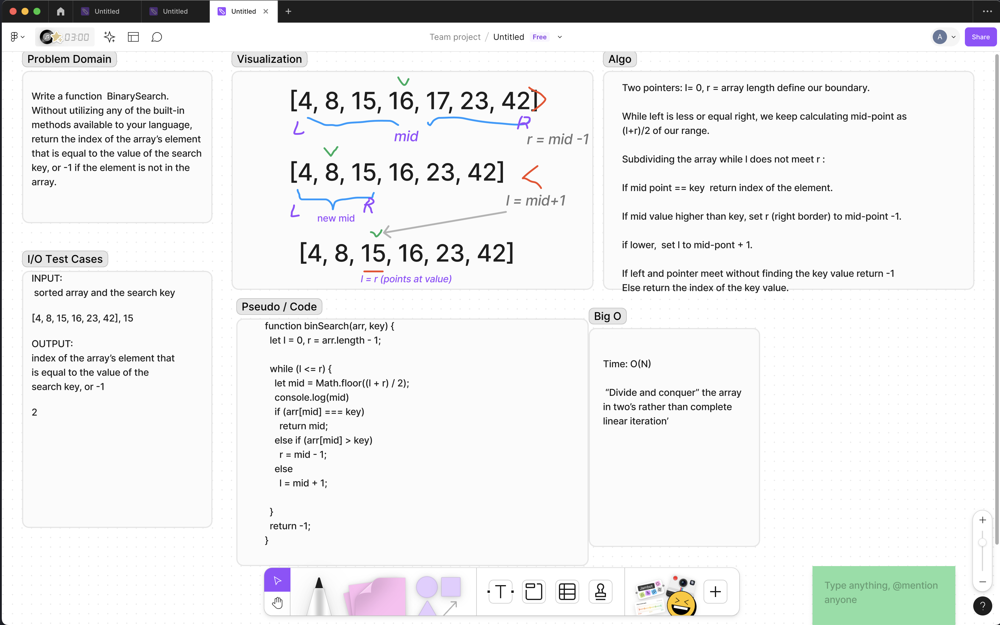

# Challenge Title
Wtrite a Binary Search Algo
## Whiteboard Process


## Approach & Efficiency
<!-- What approach did you take? Why? What is the Big O space/time for this approach? -->
Set initial _search boundaries_ of the array with two pointers: _L_  = 0, _R_ = index of last element.

While L is less or equal R, we keep calculating mid-point (rounded down) as (L + R) / 2 of current range ,
dividing the array.

If value at mid-point equals the key, return index of the element.

If value at mid-point higher than key, set **_R_** (right border) to mid-point -1.

if lower,  set **_L_** to mid-pont + 1.

If left and pointer meet without finding the key value return -1.<p>
Else return the index of the key value.


_Time Complexity:_ O (log n). <P>
"Divide and Conquer" makes it log n. <p>

## Solution.
```
function binSearch(arr, key) {
  let l = 0,
      r = arr.length - 1;

  while (l <= r) {
    let mid = Math.floor((l + r) / 2);

    if (arr[mid] === key)
      return mid;

    else if (arr[mid] > key)
      r = mid - 1;

    else
      l = mid + 1;
  }
  return -1;
}
