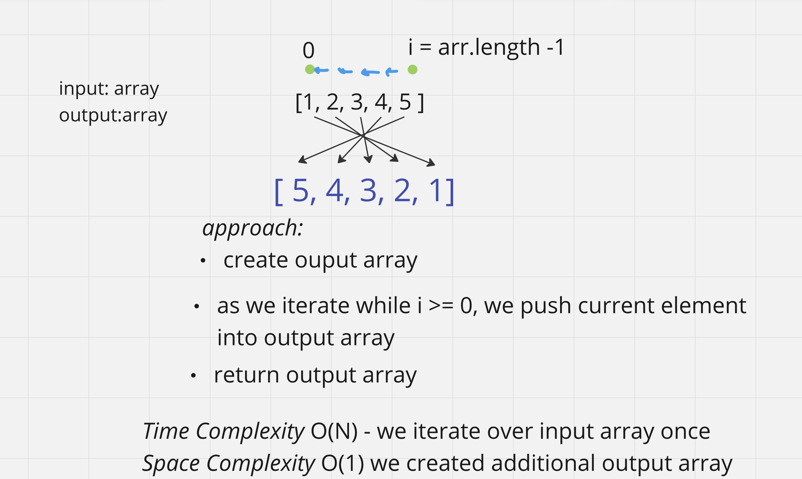

# Challenge Title
Write a function called reverseArray which takes an array as an argument.
Without utilizing any of the built-in methods available to your language,
return an array with elements in reversed order.

## Whiteboard Process

## Approach & Efficiency
<!-- What approach did you take? Why? What is the Big O space/time for this approach? -->
We iterate backwards from the last element of  input array with a for loop.
pushing elements into the output array. 

_Time Complexity:_ O(N) - we iterate over input array once. 

_Space Complexity:_ O(1) we created an additional output array
## Solution
n/a
