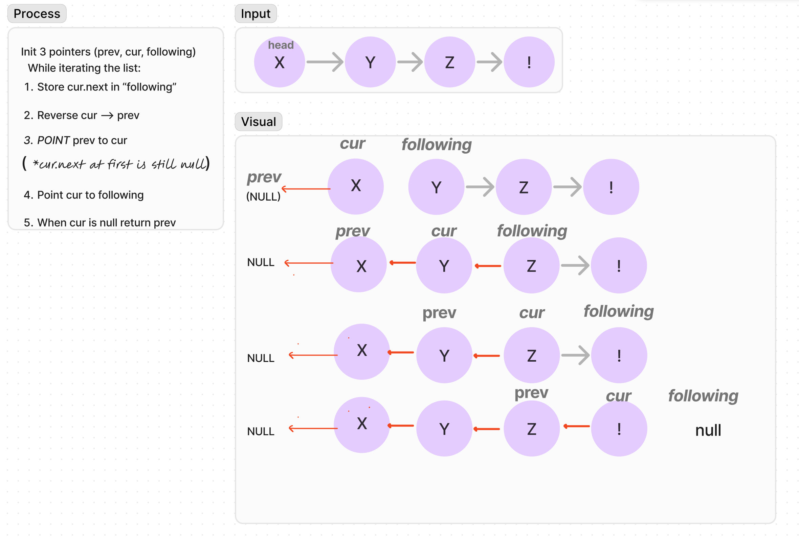

###### Day 3 CodeChallenge
### Reverse Linked List
Write a function that will reverse a single-linked list.

##### Process (Whiteboard)

[reverse.js](reverse.js)

[reverse.test.js](reverse.test.js)

### BigO

###### Time: 
**O(N)** We iterate over the input linked list once.
###### Space:
**O(1)** We introduce three variables, but no additional data structures.
The algo process the input list **in-place**.