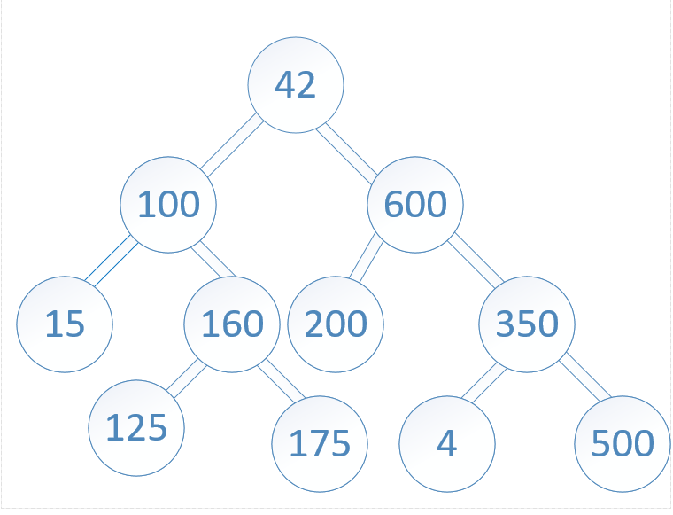

## Tree Intersection
`Write a function called tree_intersection that takes two binary trees as parameters.
Using your Hashmap implementation as a part of your algorithm, return a set of values found in both trees.`

### Whiteboard Process
<!-- Embedded whiteboard image -->

### Approach & Efficiency
1. Iterate `tree1`, use `Hashtable` to store `tree1` values.
2. Iterate `tree2` while checking if its values are present in `Hastable`, and if so, add them to results array.
3. Return results array.
#### BigO:
Time Complexity: O(n+m)

Space Complexity: O(n+m)

[BigO details.md](BigO.detaiuls.md)

### Solution  
[tree_intersection.js](tree_intersection.js)

[intersection.test.js](intersection.test.js)
<!-- Show how to run your code, and examples of it in action -->