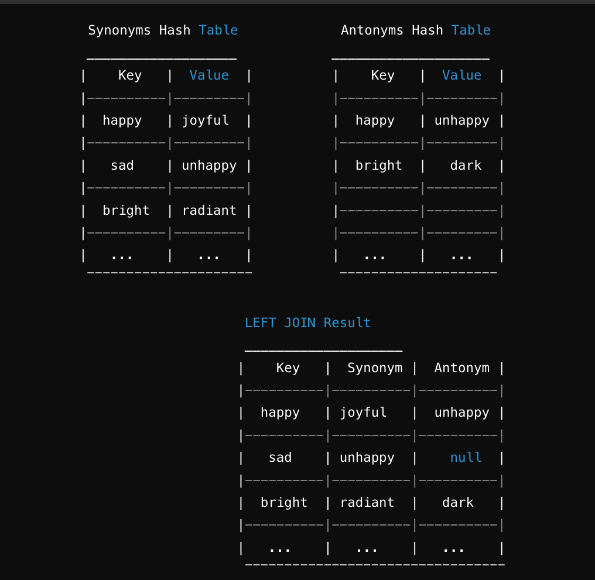

## Hashmap - Left Join
Write a function that LEFT JOINs two hashmaps into a single data structure.

    Arguments: two hash maps
    The first parameter is a hashmap that has word strings as keys, and a synonym of the key as values.
    The second parameter is a hashmap that has word strings as keys, and antonyms of the key as values.
    Return: The returned data structure that holds the results is up to you. It doesn’t need to exactly match the output below, so long as it achieves the LEFT JOIN logic
    NOTES:
    
    Combine the key and corresponding values (if they exist) into a new data structure according to LEFT JOIN logic.
    LEFT JOIN means all the values in the first hashmap are returned, and if values exist in the “right” hashmap, they are appended to the result row.
    If no values exist in the right hashmap, then some flavor of NULL should be appended to the result row.
    Structure and Testing
    Utilize the Single-responsibility principle: any methods you write should be clean, reusable, abstract component parts to the whole challenge. You will be given feedback and marked down if you attempt to define a large, complex algorithm in one function definition.
    
    Write at least three test assertions for each method that you define.
    
    Ensure your tests are passing before you submit your solution.
    
    Example
        INPUT
        Synonyms          	 	Antonyms Hash Table	 
        Key	        Value	 	Key	   Value
        diligent	employed        diligent   idle
        fond	enamored	  fond	  averse
        guide	usher	 	  guide	  follow
        outfit	garb	 	  flow	  jam
        wrath	anger	 	  wrath	  delight

    OUTPUT
        [
        ["fond", "enamored", "averse"],
        ["wrath", "anger", "delight"],
        ["diligent", "employed", "idle"],
        ["outfit", "garb", NULL],
        ["guide", "usher","follow"]
        ]
### Whiteboard Process
<!-- Embedded whiteboard image -->

### Approach & Efficiency
1. Iterate over Keys: Iterate over the keys of one of the hashmaps. Let's say we choose the synonyms hashmap for iteration.

2. Retrieve Values: For each key in the iteration, retrieve the corresponding value from the synonyms hashmap.

3. Check for Antonyms: Check if the key exists in the antonyms hashmap. If it does, retrieve the corresponding value (antonym). If it doesn't, append a placeholder value (such as null) for the antonym.

4. Construct Result: Construct a new data structure (e.g., an array of arrays) where each element contains the key, synonym, and antonym.

5. Return Result: Return the constructed data structure as the result of the left join operation.

#### Time Complexity: 
The time complexity of this approach is O(n), where n is the number of keys in the hashmap being iterated over.

#### Space Complexity: 
The space complexity is also O(n), as the result data structure grows linearly with the number of keys in the hashmap.

* Data Structure Choice: Using an array of arrays (or any other suitable data structure) for storing the result ensures efficient construction and retrieval of values.

### Solution  
#### [leftJoin.js](leftJoin.js)

#### [leftJoin Tests.js](leftJoin.test.js)
<!-- Show how to run your code, and examples of it in action -->