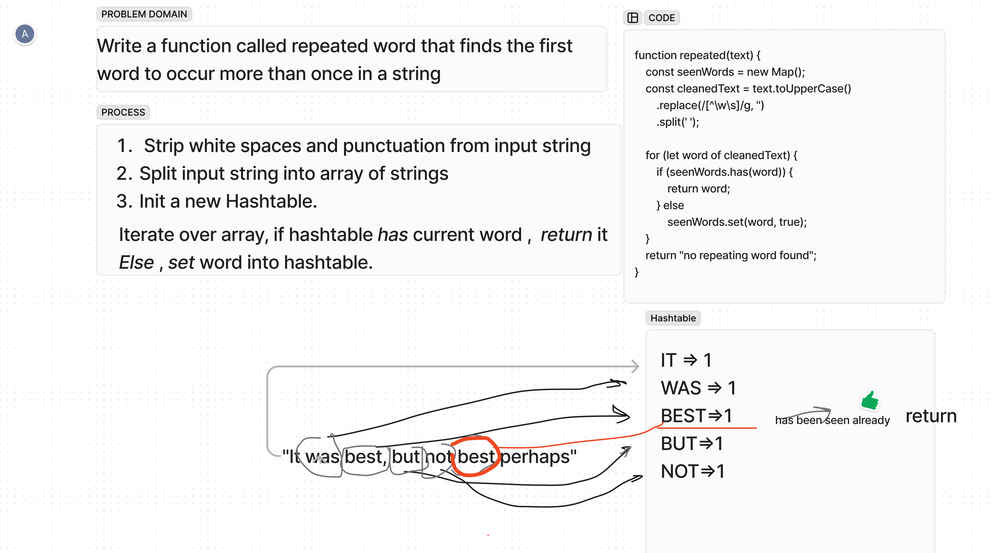

## Hashmap - Repeated Word
`Write a function called repeated word that finds 
the first word to occur more than once in a string`

Arguments: `string`
Return: `string`

### Whiteboard Process
<!-- Embedded whiteboard image -->

### Approach & Efficiency
Strip input string of punctuation and spaces (multiple as well!)

Split string into array of strings.

Create a new hashtable.

Iterate over array, if hashtable `has` current word, return it
Else, `set` word into hashtable.
<!-- What approach did you take? Why? What is the Big O space/time for this approach? -->
Time: O(N) Iterating _once._  

### Solution  
[repeatedWord.js](repeatedWord.js)

[Tests](__tests__%2FrepeatedWord.test.js)

<!-- Show how to run your code, and examples of it in action -->