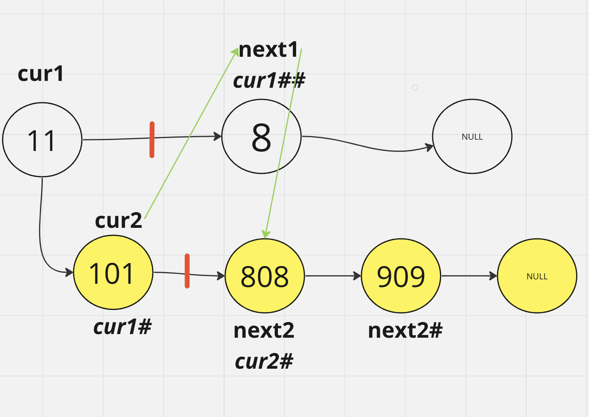

#### Challenge Title
Write a function called zip lists

Arguments: 2 linked lists

Return: New Linked List, zipped as noted below

Zip the two linked lists together into one so that the nodes alternate between the two lists and return a reference to the the zipped list.

Keep additional space down to O(1)

You have access to the Node class and all the properties on the Linked List class as well as the methods created in previous challenges.

##### Example
zipLists (list1, list2)  
Arg list1                  | Arg list2                     | Output 

{1} -> {3} -> {2} -> null **|** {5} -> {9} -> {4} -> null **|** {1} -> {5} -> {3} -> {9} -> {2} -> {4} -> null  

{1} -> {3} -> null **|** {5} -> {9} -> {4} -> null **|** {1} -> {5} -> {3} -> {9} -> {4} -> null   

{1} -> {3} -> {2} -> null	{5} -> {9} -> null	{1} -> {5} -> {3} -> {9} -> {2} -> null  

[//]: # (Stretch Goal)

[//]: # (Once you’ve achieved a working solution, implement another function that merges two sorted linked lists into a single sorted linked list.)

[//]: # (Check off the actual steps that you completed.)

[//]: # (- [ ] Top-level README “Table of Contents” is updated)

[//]: # (- [ ] README for this challenge is complete)

[//]: # (  - [ ] Summary, Description, Approach & Efficiency, Solution)

[//]: # (  - [ ] Picture of whiteboard)

[//]: # (  - [ ] Link to code)

[//]: # (- [ ] Feature tasks for this challenge are completed)

[//]: # (- [ ] Unit tests written and passing)

[//]: # (  - [ ] “Happy Path” - Expected outcome)

[//]: # (  - [ ] Expected failure)

[//]: # (  - [ ] Edge Case &#40;if applicable/obvious&#41;)

[//]: # (  )
[//]: # (  - Submit your completed work:)

[//]: # (  Copy the link to your open pull request and paste it into the assignment submission field.)

[//]: # (  Leave a description of how long this assignment took you in the comments box.)

[//]: # (  Add any additional comments to your grader about your process or any difficulties you may have had with the assignment.)

[//]: # (  Merge your branch into main, and delete your branch &#40;don’t worry, the PR link will still work&#41;.)

### Pseudocode 

Function zip_lists(list1, list2):

If either list1 or list2 is empty: return the non-empty list

_Initialize pointers:_
>cur1 = head of list1  
cur2 = head of list2

_While both current1 and current2 are not None:_

Save "next" pointers:  
> next1 = next node of cur1  
next2 = next node of current2

Point current **1**'s next to current **2**:

>cur1.next =  cur2

If next1 is **not** None:

Move: 
>cur1 to next1  
cur2 to next2

_If next1 is None:_  _Break the loop_

_Point_:
> cur2's next = next1:

_Advance_:   
>cur1 to next1  
cur2 to next2

Return list1
