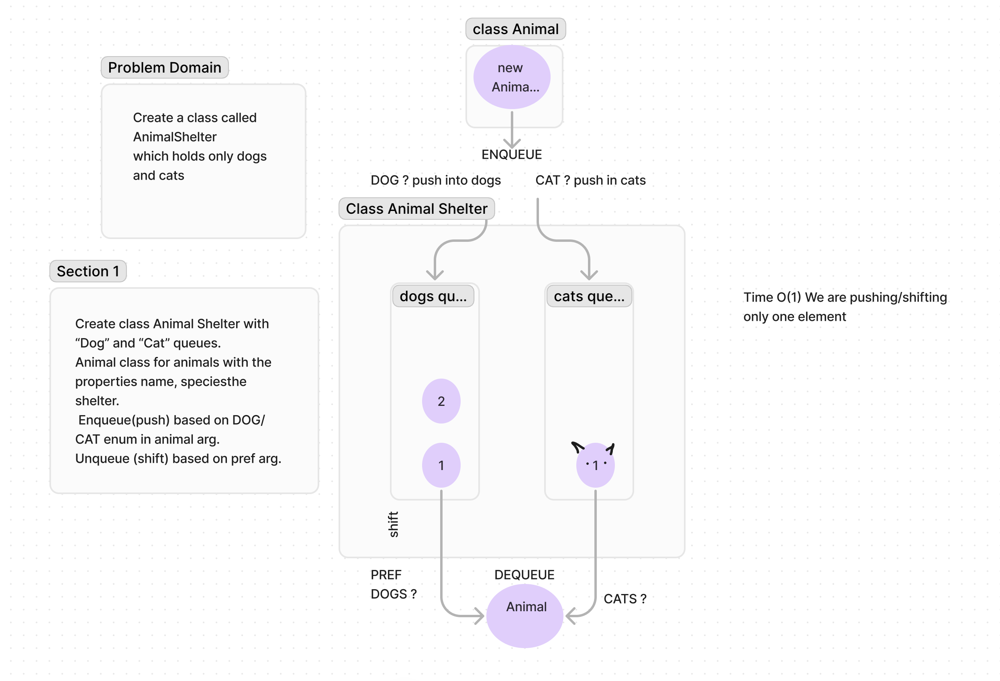

## Challenge Title 
#### Create a class called AnimalShelt which holds only dogs and cats (class 12)
## Whiteboard Process
<!-- Embedded whiteboard image -->

## Approach & Efficiency
<!-- What approach did you take? Why? What is the Big O space/time for this approach? -->
O(1) Shifting/pushing only one element.

## Solution  
[buggiest.js](Buggiest.js)
<!-- Show how to run your code, and examples of it in action -->