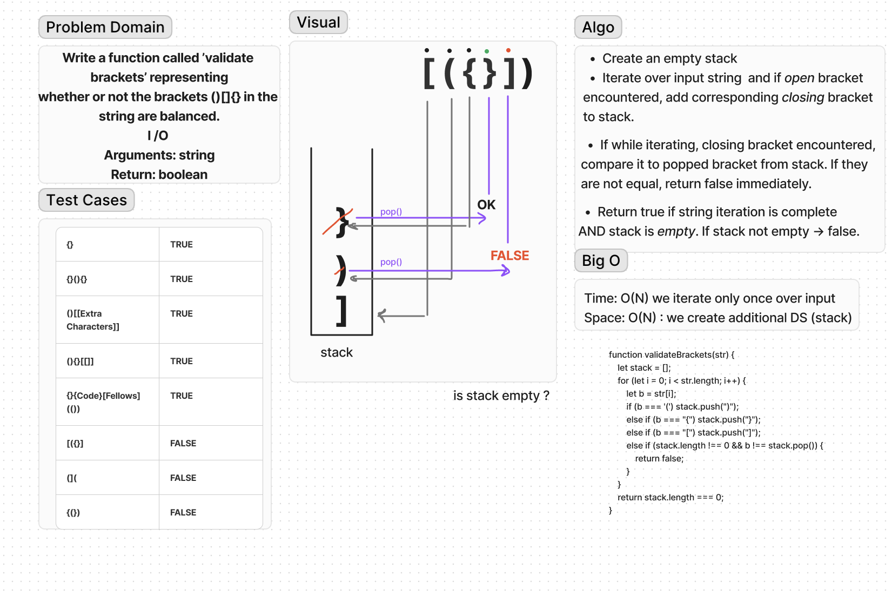

## Multi-bracket Validation

Write a function called `validate brackets`  representing   
whether or not the brackets `()[]{}` in the string are balanced. 

Arguments: `string`  
Return: `boolean`  

## Whiteboard Process
<!-- Embedded whiteboard image -->

## Approach & Efficiency
<!-- What approach did you take? Why? What is the Big O space/time for this approach? -->
Create a stack, iterate over string, push coressponding closing brackets into stack if opening brackets encountered and compare to popped stack element if closing brackets encountered.   
Time: O(N) Iterating _once._  
Space: O(N) Stack is an extra data struct
## Solution  
[validateBrackets.js](validateBrackets.js)
<!-- Show how to run your code, and examples of it in action -->