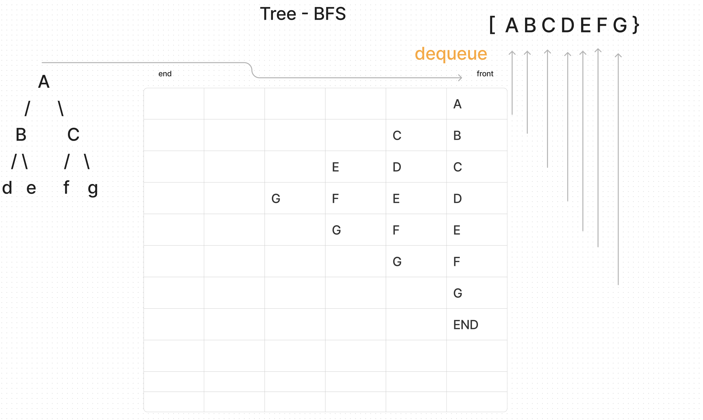

#### Write a function called breadth first
Arguments: tree  
Return: list of all values in the tree, in the order they were encountered
#### Test Example
#### Input

#### Output
#### [2,7,5,2,6,9,5,11,4]

#### Whiteboard
                    

####  Algo Process
* Initialize: Begin by initializing an empty queue to store nodes to be visited and an empty array (or list) to store the traversal order.

* Enqueue Initial Node: Add the initial node (e.g., root node) to the queue.

While Queue is Not Empty:

* Dequeue a node from the front of the queue. 
* Visit the dequeued node and add its value to the traversal array.
* Enqueue all unvisited neighboring nodes of the dequeued node into the queue.
* Until Queue is Empty:  
Continue dequeuing nodes, visiting them, and enqueuing their neighbors until the queue is empty.
#### BigO
**Time Complexity:**
The time complexity of BFS is O(V + E), where:  
**V** is the number of vertices (nodes) in the graph or tree.  
**E** is the number of edges in the graph or tree.  

**Space Complexity:**
The space complexity of BFS is O(V), where V is the number of vertices (nodes) in the graph or tree.

**Summary:**
Time Complexity: O(V + E)
Space Complexity: O(V)

>In BFS, the main space-consuming factor is the queue used to store nodes to be visited. At most, all the vertices of the graph or tree can be stored in the queue at once, leading to a space complexity proportional to the number of vertices.

>BFS is efficient for searching and traversing graphs, especially when the number of edges is proportional to the number of vertices. Its time complexity makes it suitable for a wide range of applications, such as finding shortest paths in unweighted graphs and discovering connected components.

#### Solution
[BinaryTree class with the method 'treeMax'](..%2F..%2Ftree%2FBinaryTree.js)  
[treeMax method tests](..%2F..%2Ftree%2F__tests__%2FtreeMax%20tests.js)

[//]: # (cc16)