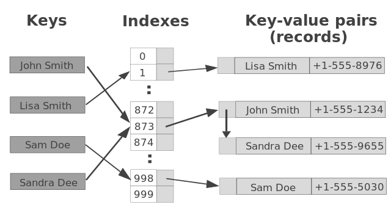

## Hashtable

#### Steps to Implement a Hashtable
1. Create the Hashtable Class
   Start by defining a class to encapsulate the hashtable's properties and methods.

2. Initialize the Hashtable
   Define the constructor to initialize the array (often called "buckets") and the hash function.

3. Define the Hash Function
   This function converts a key to an index. A simple hash function might sum the character codes of the key's characters and take the modulo with the array's length.

4. Implement Insert Method
   This method adds a key-value pair to the hashtable.

5. Implement Retrieve Method
   This method retrieves the value associated with a key.

6. Handle Collisions
   Common collision resolution strategies include chaining (using linked lists) and open addressing (probing).

[Hashtable js](Hashtable.js)

[Tests](hashtable.test.js)