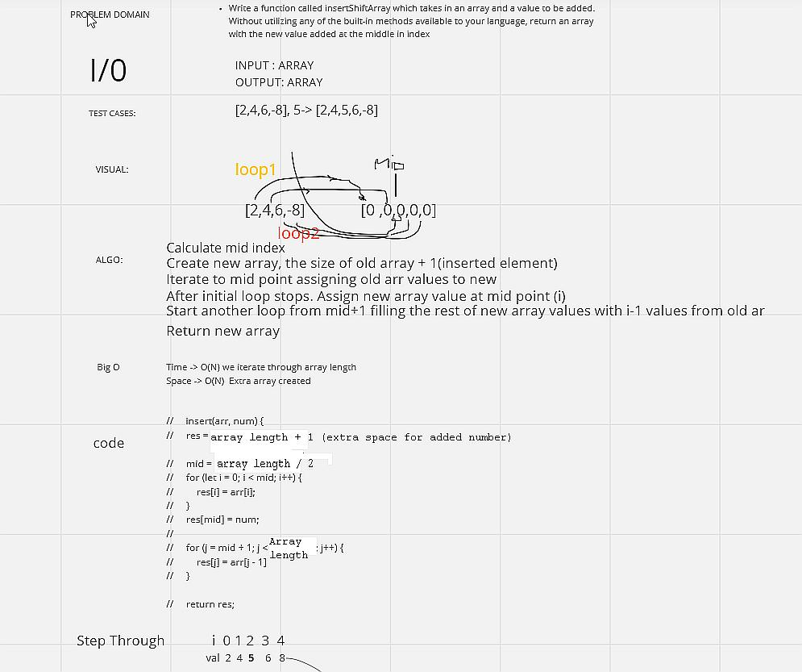

# insertShiftArray

Write a function called insertShiftArray which takes in an array and a value to be added. Without utilizing any of the built-in methods available to your language, return an array with the new value added at the middle index.

## Whiteboard Process

## Approach & Efficiency
time -> O(N)
space -> O(N)

First Loop -
Iterate to the mid-poit swapping values
at mid point assign a given value/number
iterate again from after mid point till the end of array assigning the rest of elements.
<!-- What approach did you take? Discuss Why. What is the Big O space/time for this approach? -->
