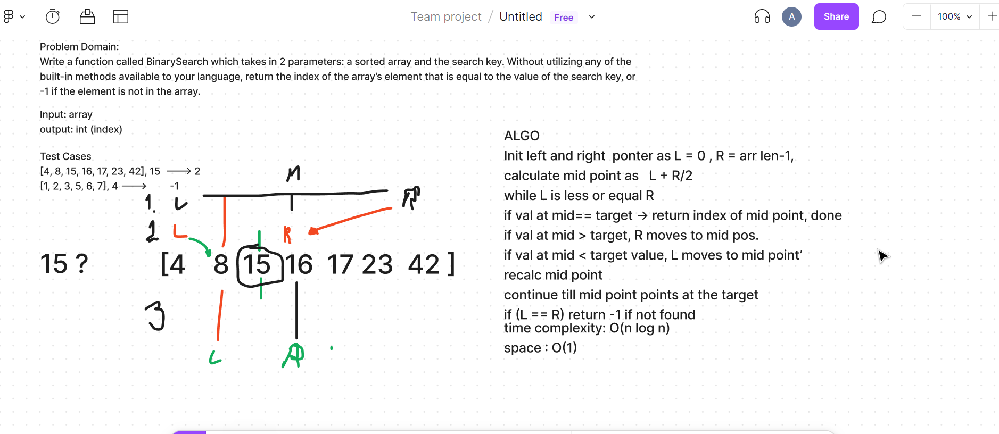

# BinarySearch

Write a function called BinarySearch which takes in 2 parameters: a sorted array and the search key. Without utilizing any of the built-in methods available to your language, return the index of the array’s element that is equal to the value of the search key, or -1 if the element is not in the array.

## Whiteboard Process

## Approach & Efficiency
time -> O(n log n)
space -> O(1)

repeatedly divide in half by calculating appropriate mid point based on current mid-point values till we find the target number or return -1

<!-- What approach did you take? Discuss Why. What is the Big O space/time for this approach? -->
