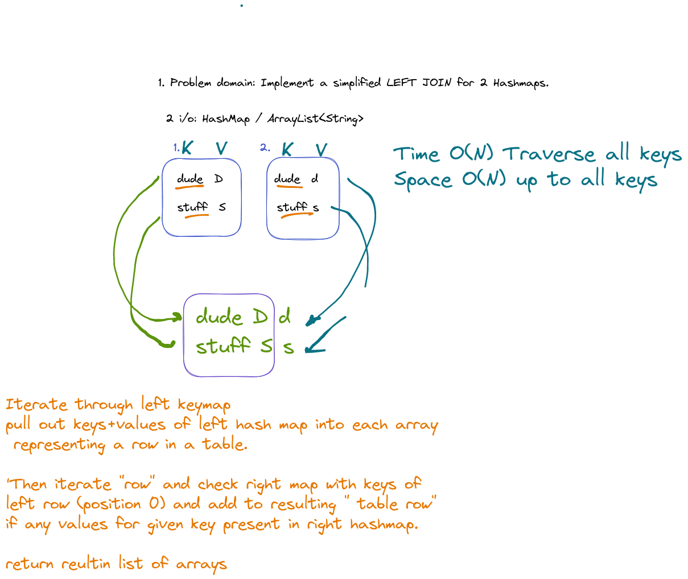

    public static ArrayList<ArrayList<String>> leftJoinHashMap(HashMap<String, String> left, HashMap<String, String> right) {
    ArrayList<ArrayList<String>> joined = new ArrayList<>();
    for (String key : left.keySet()) {
    ArrayList<String> line = new ArrayList<>(); // build a table entry
    line.add(key);
    line.add(left.get(key));
    joined.add(line);
    }

    for (ArrayList<String> line : joined) {
      String key = line.get(0);
      if (right.containsKey(key))
        line.add(right.get(key));
      else
        line.add(null);
    }
    return joined;
    }
