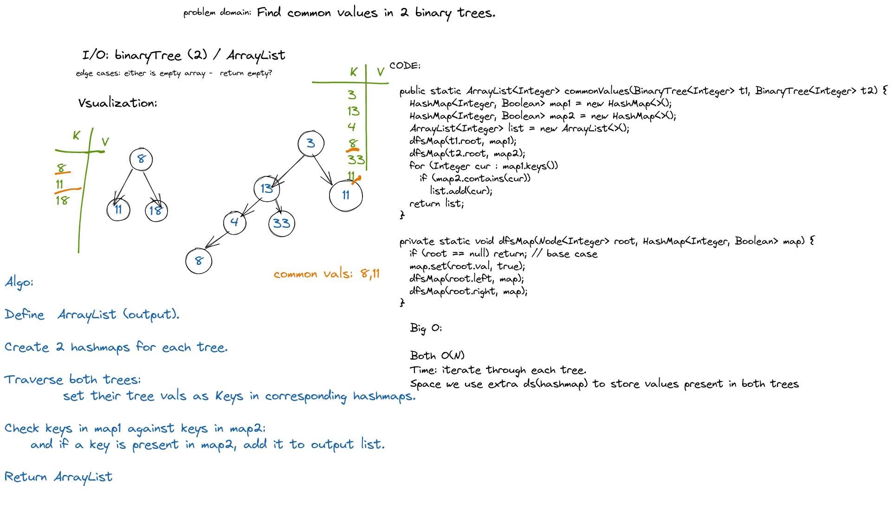

      public static ArrayList<Integer> commonValues(BinaryTree<Integer> t1, BinaryTree<Integer> t2) {
      HashMap<Integer, Boolean> map1 = new HashMap<>();
      HashMap<Integer, Boolean> map2 = new HashMap<>();
      ArrayList<Integer> list = new ArrayList<>();
      dfsMap(t1.root, map1);
      dfsMap(t2.root, map2);
      for (Integer cur : map1.keys())
      if (map2.contains(cur))
      list.add(cur);
      return list;
      }

      private static void dfsMap(Node<Integer> root, HashMap<Integer, Boolean> map) {
      if (root == null) return; //base case
      map.set(root.val, true);
      dfsMap(root.left, map);
      dfsMap(root.right, map);
      }
