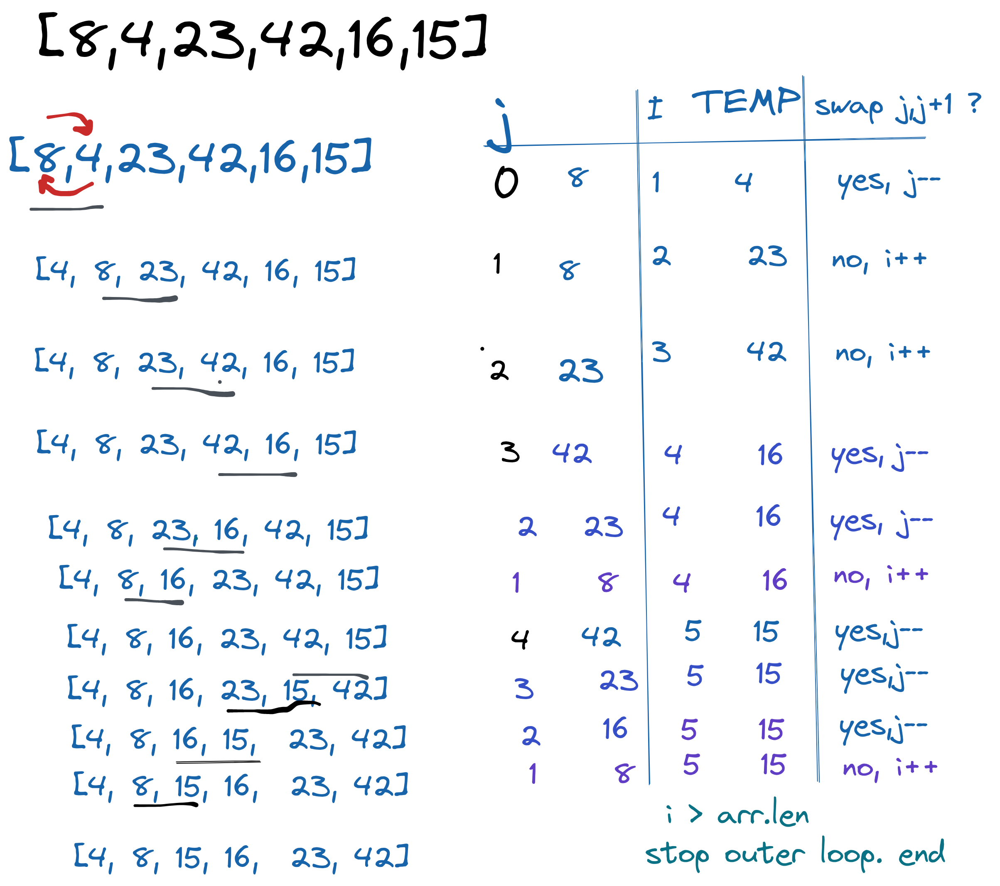

# Insertion Sort
Insertion sort is a simple sorting algorithm that works similar to the way you sort playing cards in your hands. The array is split into a sorted and an unsorted part. Values from the unsorted part are picked and placed at the correct position in the sorted part.

#### Pseudocode
InsertionSort(int[] arr)

    FOR i = 1 to arr.length

      int j <-- i - 1
      int temp <-- arr[i]

      WHILE j >= 0 AND temp < arr[j]
        arr[j + 1] <-- arr[j]
        j <-- j - 1

      arr[j + 1] <-- temp

### Trace

As we iterate through outer loop, if condition for inner loop encountered (arr[j]>temp), the arr[j] gets "inserted" to the right of itself, swapping it's value with [j+1] in algo.

Sample Arrays [8,4,23,42,16,15]

Time Complexity: Worst case scenario if the input array is reversed O(n²).
Space Complexity:O(1)  Sorted in-plac, so no extra space is used.

