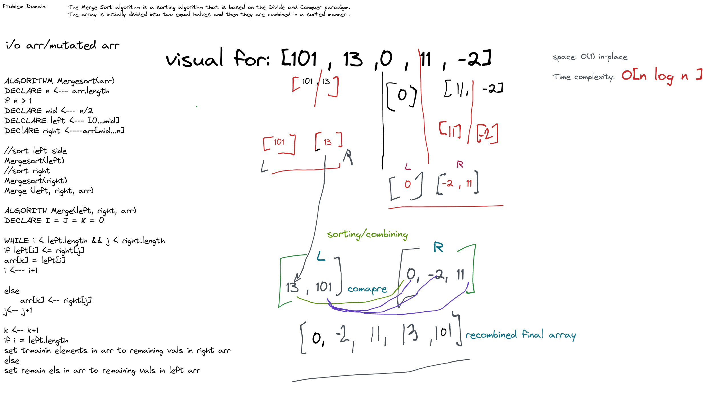

# Merge Sort

The Merge Sort algorithm is a sorting algorithm that is based on the Divide and Conquer paradigm. The array is initially
divided into two equal halves and then they are combined in a sorted manner .

#### Pseudocode (Recursive)

      ALGORITHM Mergesort(arr)
      DECLARE n <-- arr.length
      if n > 1
      DECLARE mid <-- n/2
      DECLARE left <-- arr[0...mid]
      DECLARE right <-- arr[mid...n]
      // sort the left side
      Mergesort(left)
      // sort the right side
      Mergesort(right)
      // merge the sorted left and right sides together
      Merge(left, right, arr)

    ALGORITHM Merge(left, right, arr)
    DECLARE i <-- 0
    DECLARE j <-- 0
    DECLARE k <-- 0

    while i < left.length && j < right.length
        if left[i] <= right[j]
            arr[k] <-- left[i]
            i <-- i + 1
        else
            arr[k] <-- right[j]
            j <-- j + 1

        k <-- k + 1

    if i = left.length
       set remaining entries in arr to remaining values in right
    else
       set remaining entries in arr to remaining values in left

Sample Arrays
In your blog article, visually show the output of processing this input array:

[8,4,23,42,16,15]

For your own understanding, consider also stepping through these inputs:

Reverse-sorted: [20,18,12,8,5,-2]
Few uniques: [5,12,7,5,5,7]
Nearly-sorted: [2,3,5,7,13,11]
Implementation
Provide a visual step through for each of the sample arrays based on the provided pseudocode
Convert the pseudocode into working code in your language
Present a complete set of working tests

Sample Arrays [8,4,23,42,16,15]

Time Complexity: Worst case scenario if the input array is reversed O(n²).
Space Complexity:O(1)  Sorted in-plac, so no extra space is used.

Java Code:

    public void mergeSort(int[] arr) {
    int n = arr.length, mid = n / 2;
    if (n < 2) return;
    int[] left = new int[mid];
    int[] right = new int[n - mid];
    //populate left
    for (int i = 0; i < mid; i++) {
      left[i] = arr[i];
    }
    //populate right half
    for (int i = mid; i < n; i++) {
      right[i - mid] = arr[i];
    }
      //sort left side
      mergeSort(left);
      //right= side
      mergeSort(right);
      // merge sorted L & R
      merge(left, right, arr);
    }

              void merge(int[] left, int[] right, int[] arr) {
              int i = 0, j = 0, k = 0; //left, right and new merged array iterators. ok
              while (i < left.length && j < right.length) { //merging array back comparing left and right atomic arrays
              if (left[i] <= right[j]) {
              arr[k] = left[i];
              i++;
              } else {
              arr[k] = right[j];
              j++;
              }
              k++; // result array advance pos
              }
              while (i < left.length) { //for remaining elements of left array if R is processed.
              arr[k++] = left[i++];
              }
              while (j < right.length) {//for remaining elements of right array if L is done.
              arr[k++] = right[j++];
              }
              }
              }

