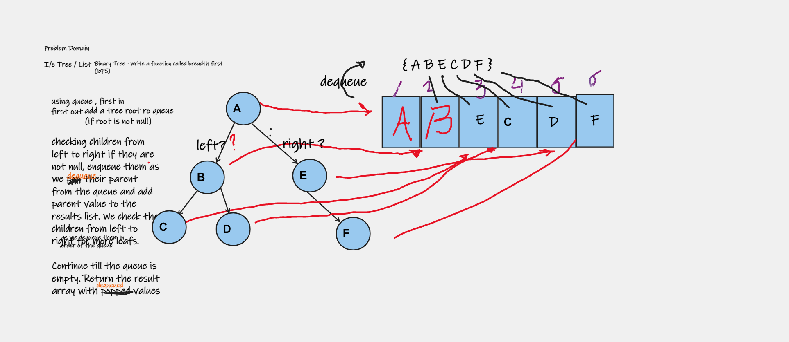

### Binary Trees - Breadth First

Write a function called breadth first (BFS)
Arguments: tree
Return: list of all values in the tree, in the order they were encountered

#### I/O (tree, list)
#### Whiteboard

#### Approach & Efficiency

Time Complexity: O(N) for N nodes in the tree.
Every node on the tree is visited
Space Complexity: O(N)
Up to half a size of the tree (N/2) for the temp queue. Rounding up

