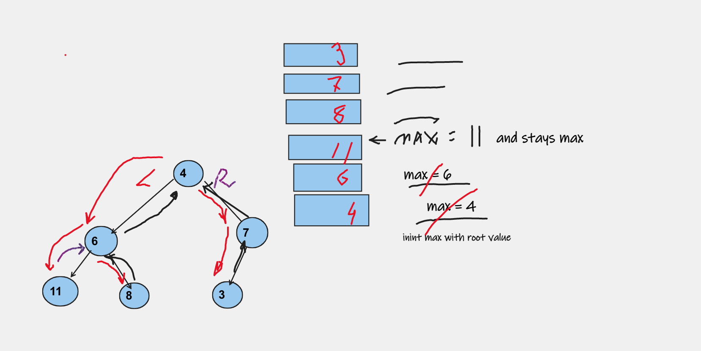

```Binary Trees ``` Max Value

Write a method extending Binary Trees that returns the maximum value in a binary tree.\
I/O: Binary tree/ int

Traverse recursively over Binary Tree (depth first) keeping track of highest value (max).\
Once recursion is completed, return max.


Whiteboard:



Time Complexity: O(N) for N nodes in the tree.
Using recursion every node of the tree is visited\
Space Complexity: O(N)
For every node visited stack space required.
