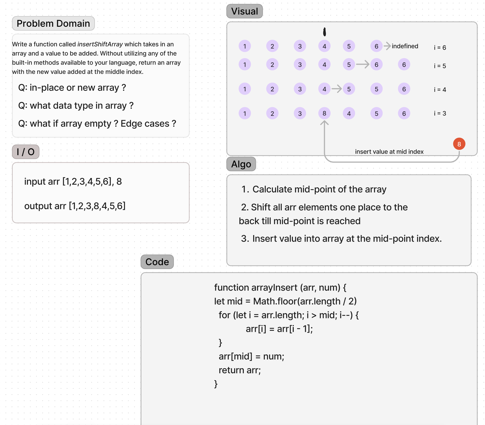

# Challenge Title
Write a function called insertShiftArray which takes in an array and a value to be added. Without utilizing any of the built-in methods available to your language, return an array with the new value added at the middle index.

## Whiteboard Process


## Approach & Efficiency
<!-- What approach did you take? Why? What is the Big O space/time for this approach? -->
We iterate backwards while shifting array by one place till we reach calculate mid-point index.
We add/insert value into array at the index <p>
_Time Complexity:_ O(N) - we iterate over input array once. <p>

## Solution
```
function arrayInsert(arr, num) {

let mid = Math.floor(arr.length / 2)

for (let i = arr.length; i > mid; i--) {

    arr[i] = arr[i - 1];

}

arr[mid] = num;

return arr;
}
