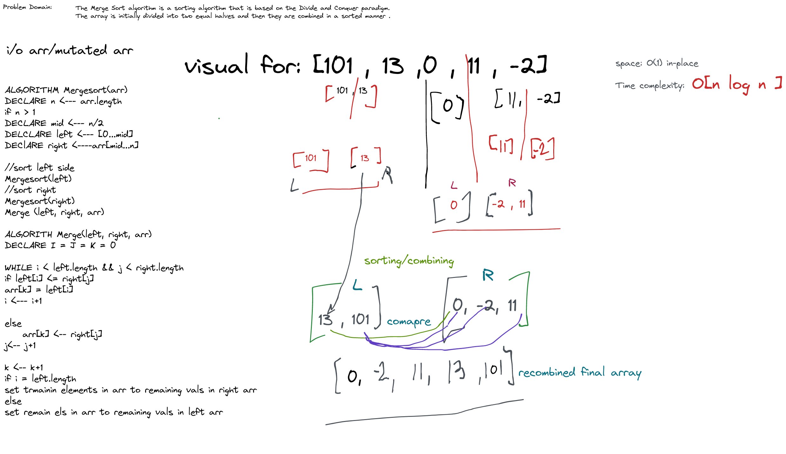

## Merge Sort

Merge Sort is a divide-and-conquer sorting algorithm that works by recursively breaking down a list into sub-lists containing a single element, 
then merging those sub-lists back together in a sorted order. 
## Pseudo    
    ALGORITHM Mergesort(arr)
    DECLARE n <-- arr.length
    if n > 1
      DECLARE mid <-- n/2
      DECLARE left <-- arr[0...mid]
      DECLARE right <-- arr[mid...n]
      // sort the left side
      Mergesort(left)
      // sort the right side
      Mergesort(right)
      // merge the sorted left and right sides together
      Merge(left, right, arr)

    ALGORITHM Merge(left, right, arr)
    DECLARE i <-- 0
    DECLARE j <-- 0
    DECLARE k <-- 0

    while i < left.length && j < right.length
        if left[i] <= right[j]
            arr[k] <-- left[i]
            i <-- i + 1
        else
            arr[k] <-- right[j]
            j <-- j + 1

        k <-- k + 1

    if i = left.length
       set remaining entries in arr to remaining values in right
    else
       set remaining entries in arr to remaining values in left

### Step-by-step explanation:
1. **Divide:**
    - The `Mergesort(arr)` function takes an array `arr` as input.
    - It calculates the length of the array (`n`) using `n <-- arr.length`.
    - If the array length is greater than 1 (`n > 1`), indicating there's more than one element to sort:
        - The middle index (`mid`) of the array is calculated as `mid <-- n/2`.
        - Two sub-arrays are virtually created:
            - `left` represents the left half of the original array (`left <-- arr[0...mid]`). This slicing syntax might vary slightly depending on the programming language.
            - `right` represents the right half of the original array (`right <-- arr[mid...n]`).
    - The `Mergesort` function is then called recursively on both `left` and `right` sub-arrays. This process of dividing continues until each sub-array has only one element.

2. **Conquer (Implicit):**
    - The recursive calls to `Mergesort` on `left` and `right` sub-arrays happen implicitly. When a sub-array reaches a single element (base case), it's considered "sorted" by itself, and the recursion stops.

3. **Merge:**
    - Once both `left` and `right` sub-arrays are sorted (due to the recursive calls), the `Merge(left, right, arr)` function combines them back into a single sorted array.
    - It takes three arrays as input:
        - `left`: The left sub-array (already sorted).
        - `right`: The right sub-array (already sorted).
        - `arr`: The original array where the sorted elements will be placed.
    - Three indices (`i`, `j`, and `k`) are initialized:
        - `i` keeps track of the current index in the `left` sub-array.
        - `j` keeps track of the current index in the `right` sub-array.
        - `k` keeps track of the current index in the `arr` (original array) where the merged elements will be placed.
    - A `while` loop continues as long as both `i` and `j` haven't reached the end of their respective sub-arrays (`i < left.length && j < right.length`).
        - Inside the loop, the elements at `left[i]` and `right[j]` are compared:
            - If the element in `left` is smaller or equal (`left[i] <= right[j]`), it means it belongs at the current position in the merged array.
                - The element from `left` is copied to `arr[k]`: `arr[k] <-- left[i]`.
                - The index `i` in the `left` sub-array is incremented (`i <-- i + 1`) to move to the next element.
            - Otherwise, the element in `right` is smaller and is copied to the merged array:
                - `arr[k] <-- right[j]`.
                - The index `j` in the `right` sub-array is incremented (`j <-- j + 1`).
        - In both cases, the index `k` in the `arr` (destination array) is incremented (`k <-- k + 1`) to move to the next position for the merged element.

4. **Combining Remaining Elements:**
    - After the `while` loop finishes, there might be leftover elements in either the `left` or `right` sub-array that weren't compared.
    - Two `if` statements handle these remaining elements:
        - If `i` reaches the end of the `left` sub-array (`i = left.length`), it means all elements from `left` have been copied. The remaining elements in `right` are copied to the `arr` using a loop (not explicitly shown in the pseudocode).
        - Otherwise, if `j` reaches the end of the `right` sub-array (`j = right.length`), the remaining elements from `left` are copied to `arr` (similar to the previous case).

5. **Sorted Array:**
    - After merging the sorted sub-arrays `left` and `right`, the `arr` array now contains all the elements
### 
### Whiteboard

### [BigO (in-depth)](mergeSort.bigO.md)
### Code
[mergeSort.js](mergeSort.js)
### Tests 
[mergeSort.test.js](mergeSort.test.js)
