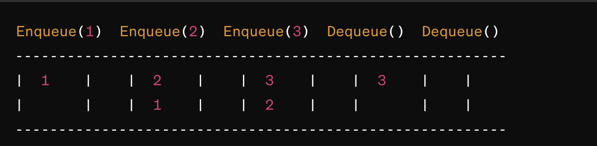

## Challenge Title
#### Implement a Queue using two Stacks (class 11)

## Whiteboard Process
<!-- Embedded whiteboard image -->

## Approach & Efficiency
<!-- What approach did you take? Why? What is the Big O space/time for this approach? -->
O(2N) ? .

## Solution  
[pseudoQueue (using two Stacks)](pseudoQueue.js)
<!-- Show how to run your code, and examples of it in action -->