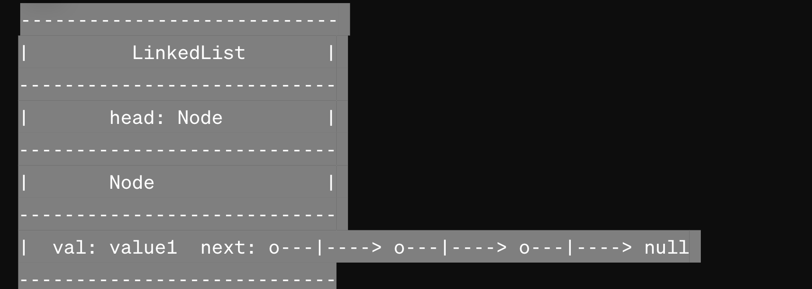
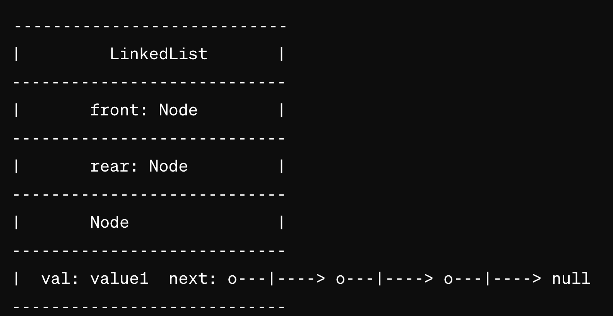

## Challenge Title
#### Stack and a Queue Implementation (class 10)

## Whiteboard Process
<!-- Embedded whiteboard image -->
#### stack diagram

#### queue diagram

## Approach & Efficiency
<!-- What approach did you take? Why? What is the Big O space/time for this approach? -->
O(N) - worst case scenario for most methods.

## Solution  
[stack-and-queue classes](stack-and-queue.js)
<!-- Show how to run your code, and examples of it in action -->