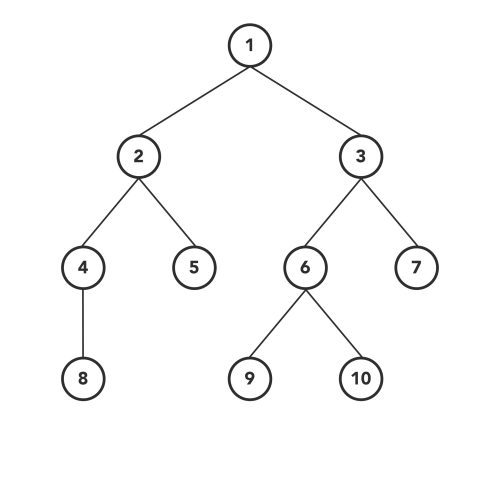

#### BFS (LEVEL)

## DFS:
### 1. Inorder 

Inorder traversal is the one the _most used_ variant of DFS traversal of the tree.

As DFS suggests, we will first focus on the depth of the chosen node and then go to the breadth at that level. Therefore, we will start from the root node of the tree 
and go deeper-and-deeper into the left subtree in a recursive manner.

When we reach the left-most node with the above steps, then we will visit that current node and go to the left-most node of its right subtree, if it exists.

Same steps should be followed in a recursive manner to complete the inorder traversal. The order of those steps will be similar, in recursive function:
    
    Go to the left subtree.
    Visit node.
    Go to the right subtree.

### 2. Preorder Traversal
   Preorder traversal is another variant of DFS. The atomic operations in a recursive function are the same as inorder traversal but in a different order.

Here, we visit the current node first and then go to the left subtree. After covering every node of the left subtree, we will move toward the right subtree and visit in a similar fashion.

Order of the steps will be:

    Visit node.
    Go to the left subtree.
    Go to the right subtree.

### 3. Postorder Traversal
   A similar process goes for the postorder traversal, where we visit the left subtree and the right subtree before visiting the current node in recursion.

So, the sequence of the steps will be:

    Go to the left subtree.
    Go to the right subtree.
    Visit the node.
